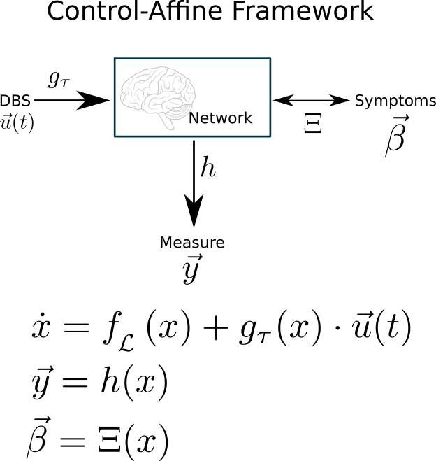
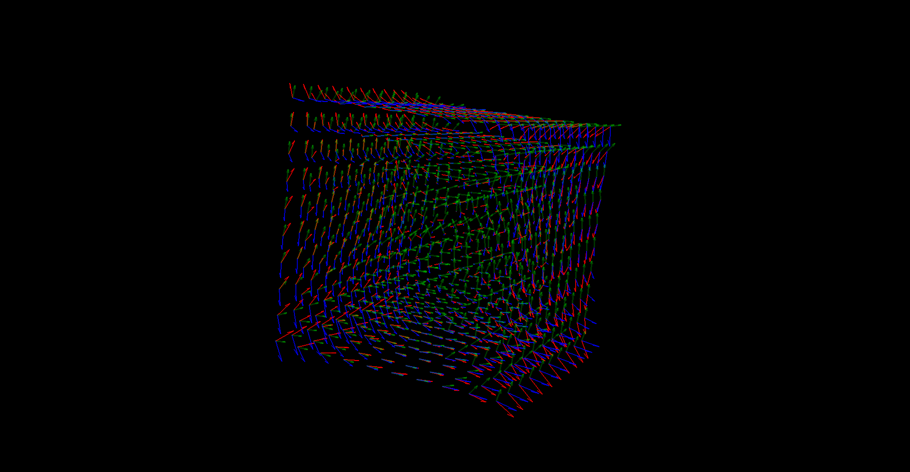
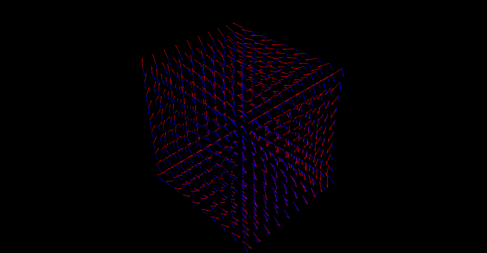

# Affine DBS

## Overview

This project is about applying control-affine analyses to the design of adaptive deep brain stimulation (DBS), specifically in psychiatric illnesses.
Using Lie analyses, the goal of this project is to develop a closed-loop DBS controller that uses estimates of the brain state to adjust stimulation parameters with a fixed neural dynamics, fixed set of stimulation locations, and fixed readout location.

### Requirements
This project uses the [AutoLie library](https://github.com/virati/autoLie)

## Repo Outline
The main scripts of this repo are examples.

### Field Interact
In field_interact.py we perform a basic, generic analysis of a control-affine system.

Running the script gets us the figure above, which shows the interaction between two vector fields in 3D
We plot the drift field in red, then the control field blue.

At this point, we have the following picture

Once we calculate the Lie derivatives of our control along the drift, to first order, we add in the green vectors seen in the first figure.

### DBS Network Control
In DBS_network_control.py we start exploring the rational design of a controller based off of a fixed stimulation and recording setup.

> Control-Disease interaction is zero: True

> Measurement-Disease interaction is zero: True

> Dyn+Ctrl is zero: True

Runnning the script gives us a (boring for now) calculation of how the control interacts with our disease mapping. In other words, how much control do we have of the neural state **with respect to how the neural state maps to the behavioral state**.

This is critical since we don' particularly care for the arbitrary control of our state to any part of the statepsace.

## The Math
For a detailed account of the math behind this work head on over to the [Jupyter notebook]()

